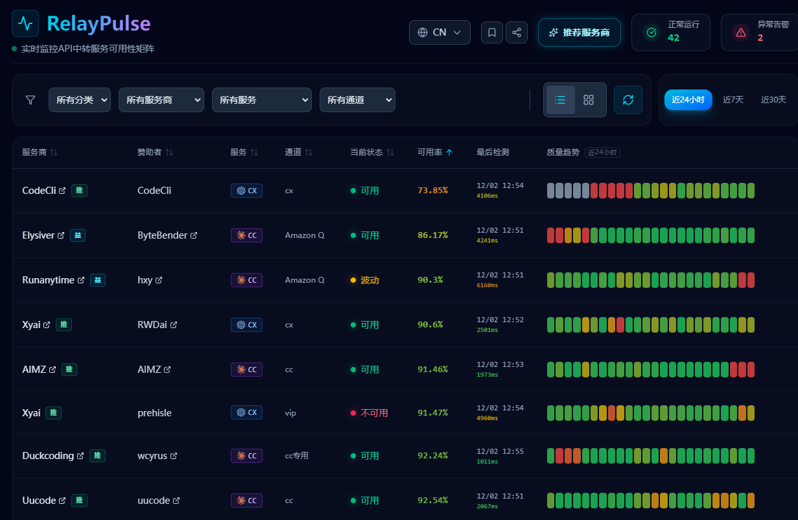

<div align="center">

# Relay Pulse

### 拒绝 API 假活，基于真实调用的 LLM 服务质量观测台

[](https://relaypulse.top)
[](https://go.dev/)
[](https://react.dev/)
[](LICENSE)



</div>

---

## 简介

传统监控工具（如 Uptime Kuma）检测的是 HTTP 连通性——但在 LLM 中转场景下，**"HTTP 200 却返回空内容或错误码"** 的"假活"现象屡见不鲜。

**RelayPulse** 通过消耗真实 Token 定时发起 API 请求，并校验响应内容。只有 LLM 真的"吐字"了，才算可用。

## ✨ 核心特性

- **💸 真实 API 探测** - 消耗真实 Token，拒绝虚假繁荣
- **📊 可视化矩阵** - 24h/7d/30d 可用率热力图，一眼看穿服务质量
- **🔄 配置热更新** - 基于 fsnotify，修改配置无需重启
- **💾 多存储后端** - SQLite（单机）/ PostgreSQL（K8s）
- **🐳 云原生友好** - 极小 Docker 镜像，支持水平扩展

## 🎯 适用场景

- 自建/采购 LLM 中转服务，持续验证 SLA
- 多云 LLM 供应商质量对比，观察延迟与错误率
- 外部 API 依赖监控，避免"假活"导致业务故障

## 💰 成本与隐私

- **探测成本极低**：`max_tokens: 1`，每次约 20 input + 1 output tokens；默认每分钟一次，约 3 万 tokens/天/服务
- **数据本地存储**：配置与密钥仅存本地/自托管环境，监控数据不回传

## 🚀 快速开始

### Docker 部署（推荐）

```bash
# 1. 下载配置文件
curl -O https://raw.githubusercontent.com/prehisle/relay-pulse/main/docker-compose.yaml
curl -O https://raw.githubusercontent.com/prehisle/relay-pulse/main/config.yaml.example

# 2. 准备配置
cp config.yaml.example config.yaml
vi config.yaml  # 填入你的 API Key

# 3. 启动服务
docker compose up -d

# 4. 访问 Web 界面
open http://localhost:8080
```

**🎬 完整安装教程**：[QUICKSTART.md](QUICKSTART.md)

### 本地开发

```bash
# 安装依赖
go mod tidy
cd frontend && npm install && cd ..

# 准备配置
cp config.yaml.example config.yaml

# 启动开发服务（带热重载）
make dev

# 或直接运行
go run cmd/server/main.go
```

**👨‍💻 开发者指南**：[CONTRIBUTING.md](CONTRIBUTING.md)

## 📖 文档导航

### 快速索引（人类读者）

| 我要...            | 看这个文档 |
|--------------------|------------|
| 🚀 5 分钟内跑起来  | [QUICKSTART.md](QUICKSTART.md) |
| 💻 本地开发/调试   | 本文档的「本地开发」章节 |
| ⚙️ 配置监控项      | [配置手册](docs/user/config.md) |
| 🤝 参与贡献        | [CONTRIBUTING.md](CONTRIBUTING.md) |

> 以上 3–4 个是项目维护方优先保证更新的「核心文档」。`AGENTS.md`、`CLAUDE.md` 主要供 AI 助手使用，通常不需要人类维护。

---

### 核心文档（建议优先阅读）
- `README.md`（本文件）：项目总览、特性介绍、快速开始、本地开发说明
- `QUICKSTART.md`：面向用户的快速部署与常见问题
- `docs/user/config.md`：配置项说明、环境变量规则、安全实践
- `CONTRIBUTING.md`：贡献流程、代码规范、提交与 PR 约定

## 🔧 配置示例

```yaml
# config.yaml
interval: "1m"         # 检查频率
slow_latency: "5s"     # 慢请求阈值

monitors:
  - provider: "88code"
    service: "cc"
    category: "commercial"
    sponsor: "团队自有"
    url: "https://api.88code.com/v1/chat/completions"
    method: "POST"
    api_key: "sk-xxx"  # 或通过环境变量 MONITOR_88CODE_CC_API_KEY
    headers:
      Authorization: "Bearer {{API_KEY}}"
    body: |
      {
        "model": "claude-3-opus",
        "messages": [{"role": "user", "content": "hi"}],
        "max_tokens": 1
      }
```

**详细配置说明**：[docs/user/config.md](docs/user/config.md)

## 🗄️ 存储后端

| 后端       | 适用场景            | 优点                   |
|------------|---------------------|------------------------|
| **SQLite** | 单机部署、开发环境  | 零配置，开箱即用       |
| **PostgreSQL** | K8s、多副本部署 | 高可用、水平扩展       |

```bash
# SQLite（默认）
docker compose up -d monitor

# PostgreSQL
docker compose up -d postgres monitor-pg
```

## 📊 API 端点

```bash
# 获取监控状态（24小时）
curl http://localhost:8080/api/status

# 获取 7 天历史
curl http://localhost:8080/api/status?period=7d

# 健康检查
curl http://localhost:8080/health

# 版本信息
curl http://localhost:8080/api/version
```

> 🔧 API 参考章节正在整理，以上端点示例即当前权威来源。

## 🛠️ 技术栈

**后端**
- Go 1.24+
- Gin (HTTP framework)
- SQLite / PostgreSQL
- fsnotify (配置热更新)

**前端**
- React 19
- TypeScript
- Tailwind CSS v4
- Vite

## 📝 变更日志

查看 [CHANGELOG.md](CHANGELOG.md) 了解版本历史和最新变更。

## 🤝 贡献

欢迎提交 Issue 和 Pull Request！请先阅读 [CONTRIBUTING.md](CONTRIBUTING.md)。

## 📈 Star History

[](https://star-history.com/#prehisle/relay-pulse&Date)

## 📄 许可证

[MIT License](LICENSE) © 2025

---

**🌐 在线演示**: https://relaypulse.top
**📦 镜像仓库**: `ghcr.io/prehisle/relay-pulse:latest`
**💬 问题反馈**: https://github.com/prehisle/relay-pulse/issues
